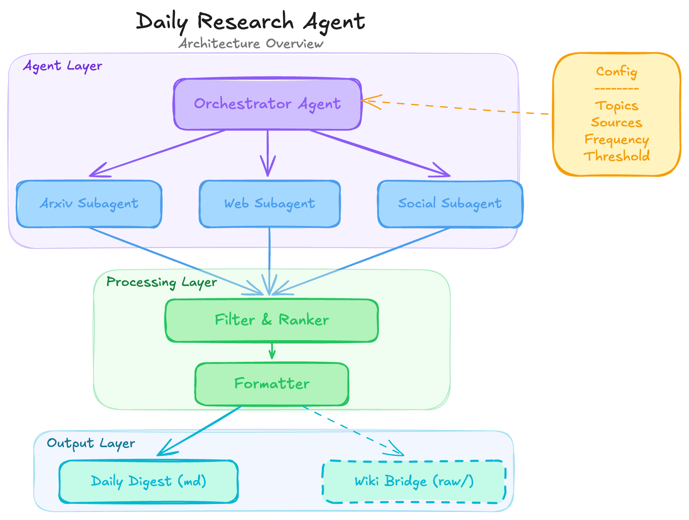
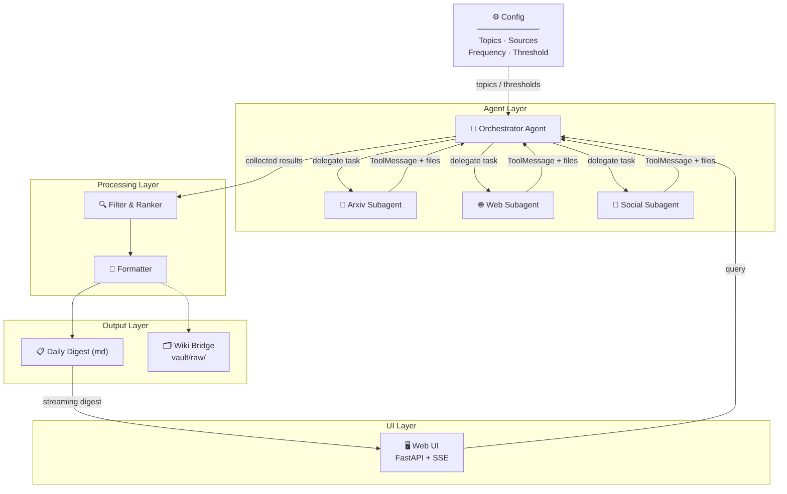

# langgraph-deep-research-agent

An autonomous AI agent that discovers, filters, and delivers daily research updates — and feeds high-signal content into your knowledge base. Built with LangGraph subagent delegation.

## Motivation

This project builds the autonomous complement to a human-triggered knowledge system. Instead of manually dropping sources into a knowledge base, this agent proactively finds information and brings it to you. Eventually, the research agent discovers content and feeds it directly into your vault for compilation.

## Architecture

> For the reasoning behind choosing LangGraph over a simple LLM tool-calling loop, see [docs/why-langgraph.md](docs/why-langgraph.md).
> For the full architecture and sequence diagrams, see [docs/architecture.md](docs/architecture.md).





### Components

| Component              | Purpose                                                                                                                                 |
| ---------------------- | --------------------------------------------------------------------------------------------------------------------------------------- |
| **Orchestrator Agent** | LangGraph top-level graph. Receives configured topics, delegates search tasks to specialized subagents, manages the pipeline end-to-end |
| **Arxiv Subagent**     | Searches arxiv API for recent papers matching topic keywords. Extracts title, abstract, authors, date                                   |
| **Web Subagent**       | Searches tech blogs, news sites, and aggregators (HN, Reddit, etc.) for relevant articles                                               |
| **Social Subagent**    | Monitors Twitter/X, LinkedIn, or other social feeds for threads and discussions from key voices                                         |
| **Filter & Ranker**    | Scores raw results against your interest profile. Deduplicates across sources. Applies relevance threshold from config                  |
| **Formatter**          | Structures filtered results into a clean daily digest (grouped by topic, with summaries and source links)                               |
| **Wiki Bridge**        | *(optional)* Drops high-signal articles into `vault/raw/` as markdown with proper frontmatter, ready for knowledge base compilation     |

### Key patterns exercised

| Pattern                         | Where                                       |
| ------------------------------- | ------------------------------------------- |
| Subagent delegation & isolation | Orchestrator -> Search subagents            |
| Multi-tool orchestration        | Each subagent manages its own tool set      |
| State management                | Results accumulate through the pipeline     |
| Conditional routing             | Orchestrator decides which sources to query |
| Scheduled autonomy              | Cron trigger (not human-triggered)          |
| System integration              | Wiki Bridge connects to existing vault      |

## Built on langgraph-coordinator-agent

This project extends [`langgraph-coordinator-agent`](https://github.com/pytholic/langgraph-coordinator-agent) — a reusable template that implements the Coordinator pattern. The coordinator solves three problems that emerge when a single agent tries to do everything:

| Problem                                                                               | How the Coordinator solves it                                                                                                 |
| ------------------------------------------------------------------------------------- | ----------------------------------------------------------------------------------------------------------------------------- |
| **Context rot** — mixed search results, schemas, and planning notes confuse the LLM   | Each sub-agent gets a clean context window with only its task description; the orchestrator keeps a separate planning context |
| **Tool overload** — too many tools cause wrong selections and hallucinated parameters | Each sub-agent manages a small, focused tool set instead of one agent juggling everything                                     |
| **Cost/speed mismatch** — not every step needs the most capable model                 | Heavyweight model for orchestration, lightweight models for search and summarization                                          |

The template provides two foundational implementation patterns:

- **Sub-agent context isolation** — when the orchestrator delegates a task, the sub-agent receives only the task description (no parent message history), preventing context pollution across parallel searches.
- **Virtual file system + context offloading** — search tools save full content to `state["files"]` and return only short summaries to the message thread. The orchestrator reads files selectively when it needs detail.

This repo builds the research-specific layer on top: multi-source subagents (Arxiv, Web, Social), a Filter & Ranker, a daily digest formatter, and an optional Wiki Bridge for knowledge base integration.

## How it differs from my other repos

| Repo                                                                                       | Key Pattern                                                                                            |
| ------------------------------------------------------------------------------------------ | ------------------------------------------------------------------------------------------------------ |
| [`langgraph-research-assistant`](https://github.com/pytholic/langgraph-research-assistant) | Multi-persona analysts, HITL checkpoint, map-reduce parallel interviews                                |
| [`langgraph-task-maistro`](https://github.com/pytholic/langgraph-task-maistro)             | Persistent memory (Postgres), Docker deployment, versioned assistants                                  |
| [`langgraph-coordinator-agent`](https://github.com/pytholic/langgraph-coordinator-agent)   | Sub-agent context isolation + virtual FS context offloading                                            |
| **`langgraph-deep-research-agent`** (this repo)                                            | Autonomous daily research with multi-source subagents, scoring/ranking, and knowledge base integration |

## Phases

### Phase 1: Single-Agent MVP

Build a minimal working agent with one search source and CLI output.

- Single LangGraph graph (no subagents yet)
- Web search via Tavily and Arxiv search (in progress)
- Basic keyword-based filtering
- Markdown digest printed to stdout or saved to file
- Hardcoded topic config

**Deliverable:** Run a script, get a markdown file with today's relevant papers and articles.

### Phase 2: Multi-Source with Subagents

Refactor into orchestrator + subagent architecture.

- Orchestrator delegates to Arxiv, Web, and Social subagents
- Each subagent is an isolated subgraph with its own tools and state
- Add scoring/ranking logic in the Filter node
- Deduplication across sources
- Configurable topics via YAML/JSON file

**Deliverable:** Multi-source digest with ranked, deduplicated results.

### Phase 3: UI + Scheduling

Add a user-facing interface and automated execution.

- Streamlit dashboard showing today's digest
- Topic/source configuration UI
- Cron-based or schedule-based daily execution
- Digest history (browse past days)

**Deliverable:** Open a browser, see today's research digest. Runs daily without manual trigger.

### Phase 4: Wiki Integration

Connect the research agent to the Obsidian vault knowledge base.

- Wiki Bridge node saves high-signal articles to `vault/raw/` with YAML frontmatter (`source_url`, `date_ingested`, `relevance_score`)
- Configurable threshold for what qualifies as "high-signal"
- Optional: auto-trigger `kb:compile` after ingestion

**Deliverable:** Research agent autonomously grows your knowledge base.

## Tech stack

- **Python 3.13+** — Primary language
- **LangGraph** — Agent orchestration, state management, subagent delegation
- **Tavily** — Web search
- **Arxiv API** — Academic paper search
- **Streamlit / Gradio** — Simple UI for digest viewing and config management *(Phase 3)*
- **Markdown** — Output format for digests

## Setup

```bash
git clone https://github.com/pytholic/langgraph-deep-research-agent
cd langgraph-deep-research-agent
uv sync
cp .env.example .env
# fill in OPENAI_API_KEY and TAVILY_API_KEY in .env
```

Run the demo notebook:

```bash
uv run jupyter notebook examples/research_demo.ipynb
```

Or import directly:

```python
from deep_research_agent.agent import create_deep_research_agent

agent = create_deep_research_agent()
result = agent.invoke({
    "messages": [{"role": "user", "content": "Find today's most relevant AI research papers."}]
})
```

## Future work

- **LangGraph Server deployment** — Deploy as a hosted API using LangGraph Server with Docker and Postgres-backed checkpointing.
- **Human-in-the-Loop** — Present a research plan before executing, allowing user approval/edits.
- **Memory architecture** — Combine short-term (thread-based state) and long-term (vector store) memory of previous research findings.
- **Contextual retrieval** — Prepend chunks with document summaries to maintain global context during retrieval.
