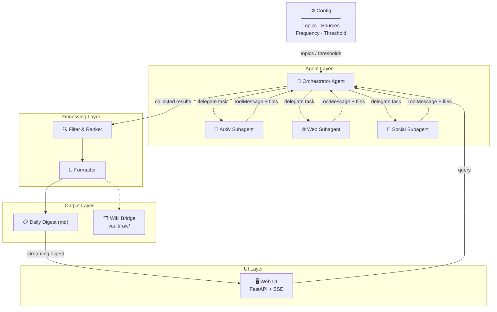
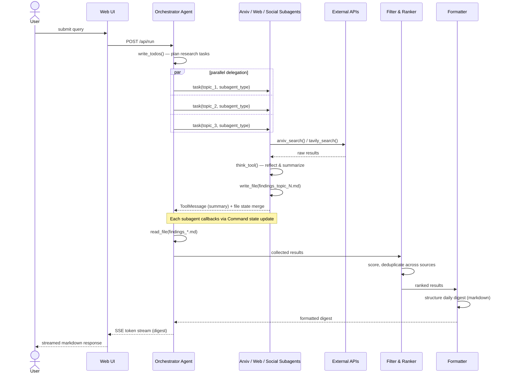

# Architecture

This document describes the target architecture for the deep research agent. The current codebase inherits the Coordinator pattern from `langgraph-coordinator-agent` and will evolve toward the multi-source architecture described below.

## High-level design

The agent operates as a two-layer pipeline: an **Agent Layer** that discovers content, and a **Processing Layer** that filters, ranks, and formats it.

> **Note:** `architecture.png` is a quick initial sketch — update it to add bidirectional arrows on subagents and a UI Layer box at the top. The Mermaid diagram below reflects the authoritative target design.



## Sequence diagram



## 1. Sub-agent context isolation (inherited)

When the orchestrator delegates a search task, it calls `_create_task_tool` which spawns a sub-agent with a **clean context window** containing only the task description — no parent message history.

```python
# In task.py — the key line
state["messages"] = [{"role": "user", "content": description}]
result = sub_agent.invoke(state)
```

Each sub-agent reasons about exactly one task in isolation. The parent receives only the sub-agent's final message as a `ToolMessage`, hiding all intermediate tool calls.

## 2. Virtual file system + context offloading (inherited)

`DeepAgentState` carries a `files` dict (filename -> content) with a custom `file_reducer` that merges updates additively:

```python
files: Annotated[NotRequired[dict[str, str]], file_reducer]
```

Search tools save full raw content to files and return only short summaries to the message thread. The orchestrator reads files only when it needs detail.

## 3. Multi-source search subagents (target)

Each search subagent is an isolated subgraph with its own tools and error handling:

- **Arxiv Subagent** — Uses the arxiv API to find recent papers matching topic keywords. Extracts title, abstract, authors, date.
- **Web Subagent** — Uses Tavily to search tech blogs, news sites, and aggregators for relevant articles.
- **Social Subagent** — Monitors Twitter/X, LinkedIn, or other social feeds for threads and discussions from key voices.

A failure in one source doesn't break the pipeline — the orchestrator collects whatever succeeded.

## 4. Filter & Ranker (target)

Scores raw results against the user's interest profile. Deduplicates across sources. Applies a configurable relevance threshold so only high-signal content reaches the digest.

## 5. Wiki Bridge (target, optional)

Drops high-signal articles into `vault/raw/` as markdown files with YAML frontmatter (`source_url`, `date_ingested`, `relevance_score`), ready for knowledge base compilation.

## Key patterns exercised

| Pattern | Where |
| --- | --- |
| Subagent delegation & isolation | Orchestrator -> Search subagents |
| Multi-tool orchestration | Each subagent manages its own tool set |
| State management | Results accumulate through the pipeline |
| Conditional routing | Orchestrator decides which sources to query |
| Scheduled autonomy | Cron trigger (not human-triggered) |
| System integration | Wiki Bridge connects to existing vault |
