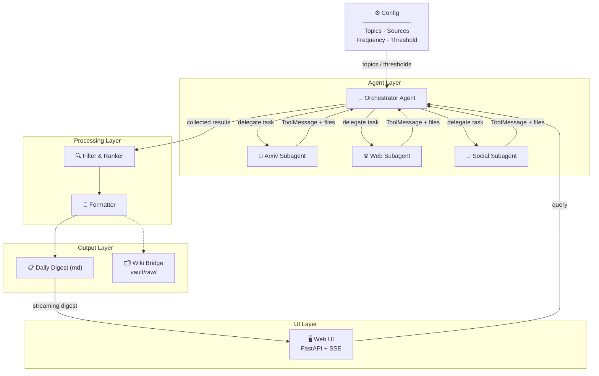
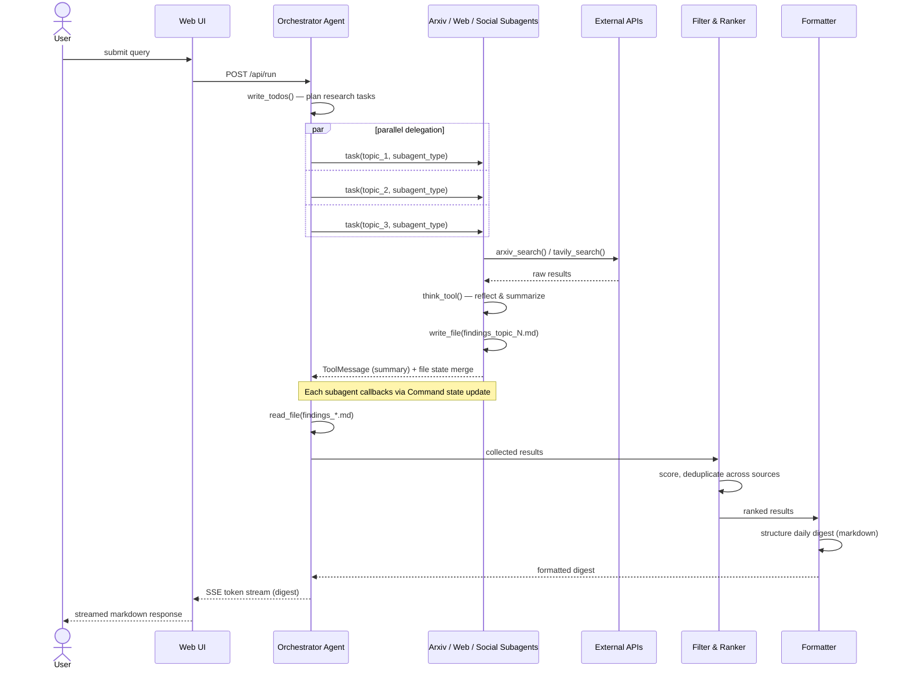

# Architecture

This document describes the target architecture for the deep research agent. The current codebase inherits the Coordinator pattern from `langgraph-coordinator-agent` and will evolve toward the multi-source architecture described below.

## High-level design

The agent operates as a two-layer pipeline: an **Agent Layer** that discovers content, and a **Processing Layer** that filters, ranks, and formats it.

> `architecture.png` is the initial sketch. The Mermaid diagram below is the authoritative target design.



## Sequence diagram



## 1. Sub-agent context isolation (inherited)

When the orchestrator delegates a search task, it calls `_create_task_tool` which spawns a sub-agent with a **clean context window** containing only the task description — no parent message history.

```python
# In task.py — the key line
state["messages"] = [{"role": "user", "content": description}]
result = sub_agent.invoke(state)
```

Each sub-agent reasons about exactly one task in isolation. The parent receives only the sub-agent's final message as a `ToolMessage`, hiding all intermediate tool calls.

## 2. Virtual file system + context offloading (inherited)

`DeepAgentState` carries a `files` dict (filename -> content) with a custom `file_reducer` that merges updates additively:

```python
files: Annotated[NotRequired[dict[str, str]], file_reducer]
```

Search tools save full raw content to files and return only short summaries to the message thread. The orchestrator reads files only when it needs detail.

## 3. Multi-source search subagents (target)

Each search subagent is an isolated subgraph with its own tools and error handling:

- **Arxiv Subagent** — Uses the arxiv API to find recent papers matching topic keywords. Extracts title, abstract, authors, date.
- **Web Subagent** — Uses Tavily to search tech blogs, news sites, and aggregators for relevant articles.
- **Social Subagent** — Monitors Twitter/X, LinkedIn, or other social feeds for threads and discussions from key voices.

A failure in one source doesn't break the pipeline — the orchestrator collects whatever succeeded.

## 4. Filter & Ranker (target)

Scores raw results against the user's interest profile. Deduplicates across sources. Applies a configurable relevance threshold so only high-signal content reaches the digest.

## 5. Wiki Bridge (target, optional)

Drops high-signal articles into `vault/raw/` as markdown files with YAML frontmatter (`source_url`, `date_ingested`, `relevance_score`), ready for knowledge base compilation.

## 6. Streaming architecture — why a custom FastAPI server

The project uses a custom FastAPI server + SSE instead of connecting the browser
directly to LangGraph Server. This is a deliberate trade-off.

### What LangGraph Server provides

LangGraph Server (via `langgraph.json`) already exposes a full REST API with
SSE streaming (`POST /threads/{id}/runs/stream`), thread persistence,
background runs, resumable connections, and cron support. Our graph is
deployable to it today.

### Why we don't use it directly from the browser

LangGraph Server streams **raw LangGraph chunks** — `updates`, `messages-tuple`,
`values` events containing serialised LangChain message objects with fields like
`tool_call_chunks`, `langgraph_node`, and namespace tuples for subgraphs.

Our UI needs **domain-specific events**: trace rows (tool / subagent /
orchestrator), streaming digest tokens, ranked source cards, and run-complete
metadata. Translating raw chunks into these events requires:

1. **Message-type filtering** — distinguishing `AIMessageChunk` tokens from tool
   call dispatches by checking `tool_call_chunks` and `langgraph_node`.
2. **Subgraph namespace tracking** — maintaining a `seen` set of namespace
   tuples to label and count research sub-agents.
3. **Post-run source extraction** — parsing the virtual file system
   (`state["files"]`) into structured source metadata after the stream ends.

Doing this in vanilla JavaScript would mean reimplementing Python-native checks
(e.g. `isinstance(msg, AIMessageChunk)`) against raw JSON, with no SDK support
for the `useStream` hook in non-React frontends.

### Current approach: shared `streaming.py` generator

All stream interpretation lives in `streaming.py::stream_events()` — a single
async generator that consumes `agent.astream()` and yields output-agnostic event
dicts (`trace`, `digest`, `sources`, `done`, `error`).

Both consumers are thin:

- **FastAPI server** (`ui/server.py`): pipes events into an `asyncio.Queue` → SSE.
- **CLI** (`examples/utils.py`): renders events with Rich.

### Migration path to LangGraph Server

If we migrate later, two options exist:

- **Option A (custom stream mode):** Use `get_stream_writer()` inside graph
  nodes to emit our event format via `stream_mode="custom"`. Couples UI
  concerns into graph logic.
- **Option B (thin proxy):** Replace `agent.astream()` with
  `client.runs.stream()` (LangGraph Python SDK) inside `stream_events()`.
  The server becomes a translation proxy — graph stays clean, consumers
  unchanged.

Option B is preferred: one function swap in `streaming.py`, zero changes to
`server.py`, `utils.py`, or `index.html`.

## Key patterns exercised

| Pattern                         | Where                                       |
| ------------------------------- | ------------------------------------------- |
| Subagent delegation & isolation | Orchestrator -> Search subagents            |
| Multi-tool orchestration        | Each subagent manages its own tool set      |
| State management                | Results accumulate through the pipeline     |
| Conditional routing             | Orchestrator decides which sources to query |
| Scheduled autonomy              | Cron trigger (not human-triggered)          |
| System integration              | Wiki Bridge connects to existing vault      |
